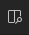

# Clean Thesis
*-- A Clean LaTeX Style for Thesis Documents --*

## Table of contents

* [About](#about)
* [Getting started](#getting-started)
* [Documentation and Support](#documentation-and-support)
* [Contributing](#contributing)
* [License Information](#license-information)

## About

**Clean, Simple, Elegant**
*Clean Thesis* is a LaTeX style for thesis documents. The style can be understood as my personal compromise — a typical clean looking scientific document combined and polished with minor beautifications. The design of this *Clean Thesis* style is inspired by user guide documents from Apple Inc.

## Getting started

* Download and install [VSCode](https://code.visualstudio.com/) and [Docker](https://www.docker.com/products/docker-desktop/)
* Install the [Remote-Container extension](https://marketplace.visualstudio.com/items?itemName=ms-vscode-remote.remote-containers) in VSCode.
* Download this repo and open the respective folder in VSCode. Select the 'Reopen in Container option'.

* You can build the `my-thesis.tex` document with `Ctrl/Cmd+Shift+P -> Latex Workshop: Build LaTeX project`. You can view the pdf by clicking on the  icon on the upper right.

## Documentation and Support

The [documentation](doc/cleanthesis-doc.pdf) gives an overview of available package options.

Please use [Stack Exchange](http://tex.stackexchange.com/questions/tagged/cleanthesis) for questions about **using** *Clean Thesis*; and add the tag **cleanthesis** to your question. GitHub issues are for development purposes, e.g, reporting actual bugs or requesting new features.

## Going further

* [Learn Git and Github](https://www.youtube.com/watch?v=RGOj5yH7evk) for collaboration and project management.
